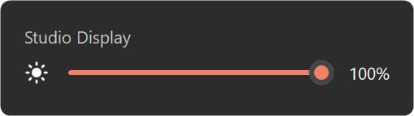

# Apple Studio Display Brightness Control for Windows

Control **Apple Studio Display brightness on Windows** from a small tray app with a Windows 11-style slider and hotkeys, or from a PowerShell CLI. It talks directly to the display over **USB HID feature reports** (no DDC/CI dependency).

If you searched for terms like _studio display brightness windows_, _apple studio display windows brightness control_, or _studio display brightness slider_, this is the tool.



## Download

**[StudioDisplayBrightness.exe](https://github.com/michaljach/win-studio-display/releases/latest/download/StudioDisplayBrightness.exe)** from the [latest release](https://github.com/michaljach/win-studio-display/releases/latest). It's a single file, with nothing to install; run it and a sun icon appears in the notification area.

The EXE isn't code-signed yet, so SmartScreen may warn on first run (*More info → Run anyway*). You can also [build it yourself](#build-from-source) in a few seconds.

## Tray app

- **Click the sun icon** for a flyout with a brightness slider per Studio Display (drag, mouse wheel or arrow keys).
- **Hotkeys**: `Ctrl+Alt+PageUp` / `Ctrl+Alt+PageDown` change brightness by 5% and show an on-screen indicator. Hold to repeat.

  

- **Remembers brightness** per display and re-applies it when the display connects or the app starts.
- **Right-click** for *Start with Windows*, the restore toggle, and *Edit settings* (step size, hotkeys; changes apply on save).
- Follows the Windows light/dark theme and accent color; per-monitor DPI aware.

On Windows 11 new tray icons go to the overflow menu (^); drag the icon onto the taskbar (or enable it under
*Settings > Personalization > Taskbar > Other system tray icons*) to keep it visible.

Settings live in `%APPDATA%\StudioDisplayBrightness\settings.ini`, the log in
`%LOCALAPPDATA%\StudioDisplayBrightness\tray.log`.

## Build from source

```powershell
.\tray\build.ps1
.\dist\StudioDisplayBrightness.exe
```

The build uses the C# compiler that ships with Windows (.NET Framework 4.8), so no Visual Studio or SDK is
needed. The EXE is AnyCPU and runs natively on x64 and ARM64.

## CLI

```powershell
# List detected Studio Displays (serial + pid + interface + brightness)
.\tools\studio-display-brightness.ps1 list

# Get brightness
.\tools\studio-display-brightness.ps1 get

# Set brightness (0-100, optional % suffix)
.\tools\studio-display-brightness.ps1 set 55
.\tools\studio-display-brightness.ps1 set 55%

# Increase/decrease by step (1-100)
.\tools\studio-display-brightness.ps1 inc 10
.\tools\studio-display-brightness.ps1 dec 10

# Target by serial (recommended when available)
.\tools\studio-display-brightness.ps1 get -Serial "YOUR_SERIAL"
.\tools\studio-display-brightness.ps1 set 65 -Serial "YOUR_SERIAL"

# Target by list index
.\tools\studio-display-brightness.ps1 get -Index 0
.\tools\studio-display-brightness.ps1 set 65 -Index 0
```

CMD wrapper equivalents (no execution-policy prompts):

```cmd
tools\studio-display-brightness.cmd list
tools\studio-display-brightness.cmd set 60
```

## Why there is no native Windows slider

Windows only offers its own brightness slider for external monitors through DDC/CI, which the Studio Display
doesn't implement; it takes brightness over USB HID instead. `driver/` contains an experimental kernel-mode
filter driver that exposes the Windows panel-brightness interface for the display, but Windows 11 only uses
that interface for internal panels, so it does not produce a Settings/Quick Settings slider either. Details
are in [driver/README.md](driver/README.md) and `tasks/todo.md`.

## Requirements

- Windows 10 or Windows 11 (x64 or ARM64)
- Apple Studio Display connected by USB-C / Thunderbolt
- For the CLI: PowerShell 5.1+ or PowerShell 7+

## Supported monitors

Known supported:

- Apple Studio Display (27-inch) over USB-C/Thunderbolt
- Apple Studio Display hardware revisions that expose Apple HID brightness report support (`VID_05AC`, commonly `PID 0x1114..0x1117`)

Compatibility-based support (detected automatically):

- Newer or variant Apple displays that expose the same HID brightness feature report
- Listings/search terms such as "Apple Studio Display XDR 2026" if the connected device reports compatible Apple HID brightness endpoints

Not yet verified in this repository:

- Apple Pro Display XDR (community testing welcome)

## Repository layout

- `tray/` - Tray app source (`src/`) and `build.ps1` (output: `dist/StudioDisplayBrightness.exe`).
- `tools/studio-display-brightness.ps1` - CLI.
- `tools/studio-display-brightness.cmd` - CMD launcher for the CLI.
- `driver/` - Experimental monitor filter driver (see "Why there is no native Windows slider").

## Technical details

HID behavior follows the same approach used by `himbeles/studi` / `asdbctl`:

- Vendor ID: `0x05AC` (Apple)
- Product ID/interface auto-detection with preference for known Studio Display combos (for example `PID 0x1114`, `MI_07`)
- HID report: 7 bytes (`report id 1` + 4-byte little-endian brightness + 2 padding bytes)
- Raw brightness range: `400..60000` (0.01 nit units) mapped to `0..100%`

## Troubleshooting

- Generic monitor names in Windows settings are expected and do not block control.
- The tray flyout says "No Studio Display found": test a direct connection (some docks/adapters block the required HID interface), then check `tray.log`.
- `list` in the CLI shows `pid` and `mi` to help identify hardware/interface variants.
- A hotkey warning balloon means another app already uses that shortcut; pick another in *Edit settings*.

## Discoverability keywords

Apple Studio Display, Windows brightness control, Studio Display brightness slider, Studio Display tray app, USB HID brightness CLI, PowerShell HID monitor control.
